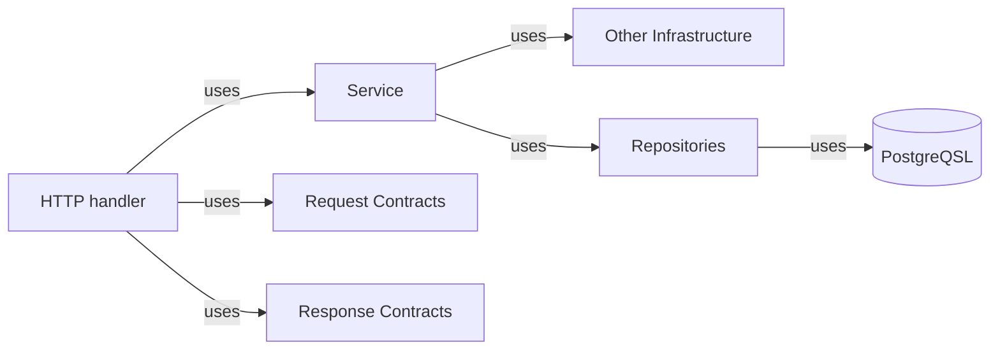

# Bluelight 

## Contract Based Architecture

- Contracts are explicit and put in their own  layer.

- The Handlers will use the contracts layer to read http requests and validate they are not malformed and also for sending responses.

- To prepare responses, handlers talk to the application services layer which should be representative of the usecases.

- The domain objects should have no clue that they are bing used in a web application or stored using a sql database. I'm strongly againest putting annotaions or core domain entities.

- Demo REST API 
- Implemented with ideas from DDD and clean architecure.
  

## Features

- Sending JSON Respnses and Parsing JSON Requests
- Runtime app configutation
- Database setup and confguration
- SQL migrations
- CRUD operations
- Optimistic Concurrency Control
- Filtering, Sorting, and Pagination
- Rate limiting
- Sending Emails and Calling external APIs
- Graceful shutodown
- Authentication And Authorization
- Background operations
- CORS
- Metrics and Monitoring
