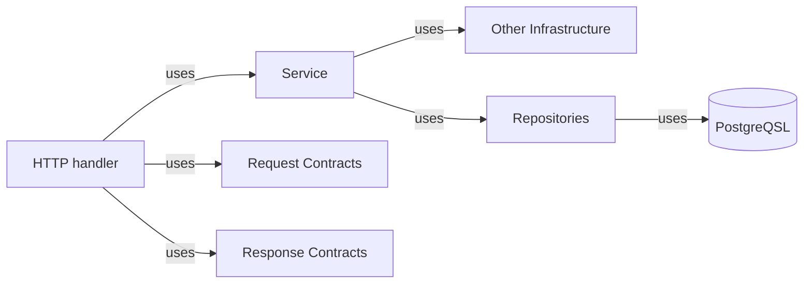

# Bluelight 

## Contract Based Architecture

- Contracts are explicit and put in their own  layer.

- The Handlers will use the contracts layer to read http requests and validate they are not malformed and also for sending responses.

- To prepare responses, handlers talk to the application services layer which should be representative of the usecases.

- The domain objects should have no clue that they are bing used in a web application or stored using a sql database. I'm strongly againest putting annotaions on core domain entities.

## Features

- Sending JSON Respnses and Parsing JSON Requests
- Runtime app configutation
- Database setup and confguration
- SQL migrations
- CRUD operations
- Optimistic Concurrency Control
- Filtering, Sorting, and Pagination
- Rate limiting
- Sending Emails and Calling external APIs
- Graceful shutodown
- Authentication And Authorization
- Background operations
- CORS
- Metrics and Monitoring

## Acknowledgments 

- I learned alot from Alex Edwards books (I think its the best resource to learn Go).

- I also learned alot from Kent Beck books and his ideas about software design. I recommend alot reading his
  recent Book Tidy First. 

- I also can't recommend more Mark Richards and Neals Ford writings about software architecture.

Thank you All

Mohamed Kamal
